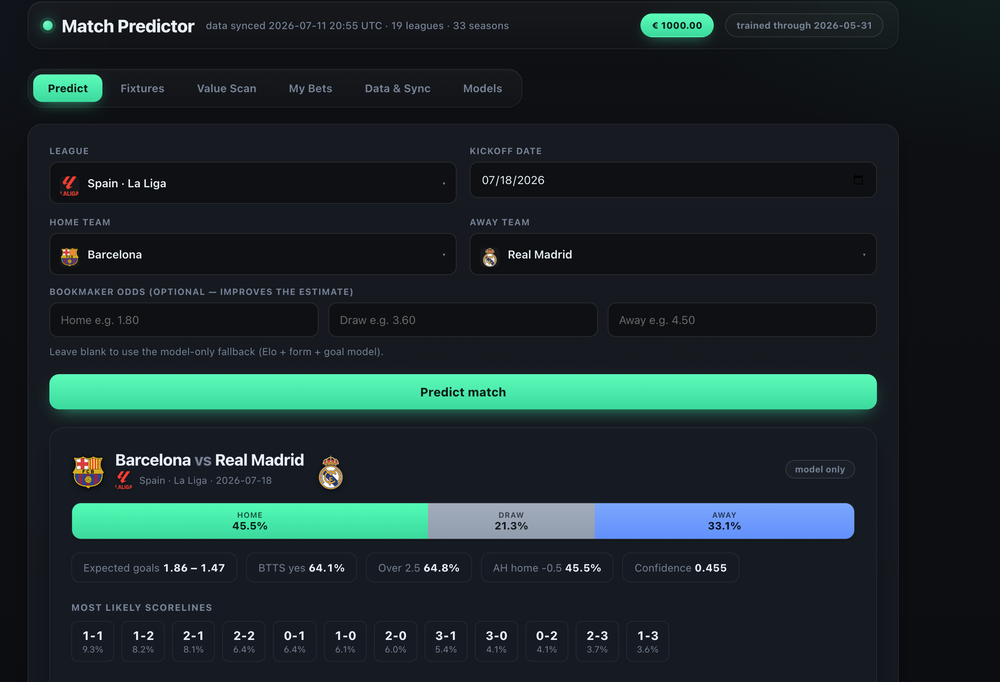
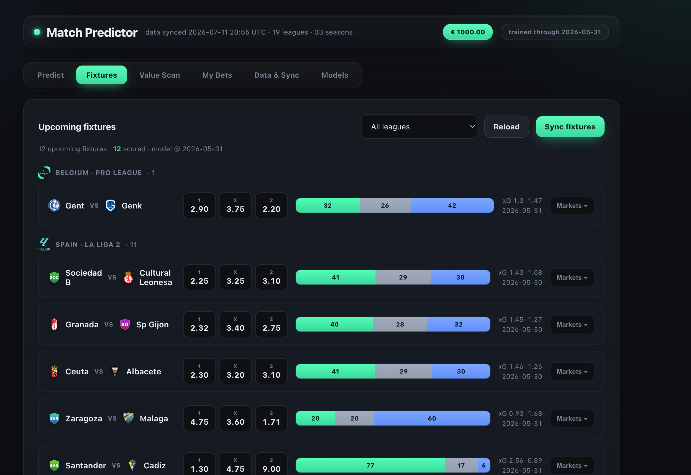
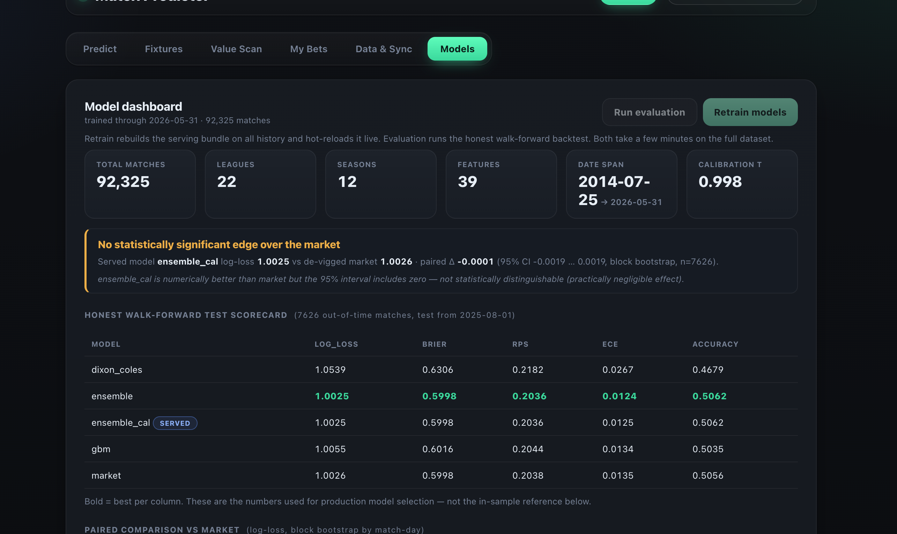

<div align="center">

# ⚽ Match Predictor

**Calibrated football match prediction — honesty over headline accuracy.**

Turns 30+ seasons of results & odds into *well-calibrated probabilities* for every
major market (1X2, correct score, Over/Under, BTTS, Asian handicap) — with a
sportsbook-style web UI and paper-money betting.

[](https://www.python.org/)
[](#tests)
[](LICENSE)
[](#-disclaimer)



</div>

## What it does

- **Predicts any fixture** — calibrated 1X2, expected goals, top scorelines,
  BTTS, Over/Under and Asian handicap, all from one coherent score matrix.
- **Models:** Elo · time-weighted **Dixon-Coles** · **LightGBM** (+SHAP) ·
  **stacked ensemble** · temperature/isotonic **calibration**.
- **Honest by design:** strictly pre-kickoff (no-leakage) features and
  **chronological walk-forward** evaluation against the strong de-vigged
  bookmaker baseline — with paired bootstrap significance tests.
- **Paper-money web UI:** browse live fixtures, place €1000-balance paper bets
  that auto-settle against real results. No real money, ever.

## Results (honest, out-of-time)

7,626 out-of-time matches · test from 2025-08-01 · 22 leagues · models never see the future.

| model | log-loss | Brier | RPS | ECE | acc |
|---|---|---|---|---|---|
| market (de-vigged odds) | 1.0026 | 0.5998 | 0.2038 | 0.0135 | 0.506 |
| Dixon-Coles | 1.0539 | 0.6306 | 0.2182 | 0.0267 | 0.468 |
| LightGBM | 1.0055 | 0.6016 | 0.2044 | 0.0134 | 0.504 |
| **ensemble + calibration** (served) | **1.0025** | **0.5998** | **0.2036** | **0.0125** | **0.506** |

The ensemble is *numerically* the best (log-loss 1.0025 vs the market's 1.0026),
but a paired block-bootstrap puts the difference at **Δ −0.00007, 95% CI
−0.0019…+0.0019, p = 0.96** — the interval includes zero. So the honest claim is:
**the model matches the bookmaker line and does not beat it.** Calibration is the
point, not a headline win.

## Quickstart

```bash
git clone https://github.com/Reymes/football-match-prediction.git
cd football-match-prediction
python3.12 -m venv .venv && source .venv/bin/activate
pip install -r requirements.txt

# Launch the web UI (trains a model bundle on first run if missing)
python scripts/train.py --out artifacts     # once, a few minutes
python app.py                                # → http://127.0.0.1:5001
```

Or use it from the command line:

```bash
python scripts/run_backtest.py               # honest walk-forward scorecard
python scripts/predict_upcoming.py           # score upcoming fixtures
```

## Screenshots

**Live fixtures** — model 1X2 vs feed odds, expected goals, and every market from one matrix:



**Model dashboard** — the honest scorecard and paired significance test, in the app:



## How it works

```
sync (football-data.co.uk)  →  ingest  →  validate
  →  leakage-safe features (Elo → form → context → market, all pre-kickoff)
  →  Dixon-Coles · LightGBM · de-vigged market
  →  stacked ensemble  →  calibration  →  one reconciled score matrix
  →  1X2 · xG · scorelines · O/U · BTTS · Asian handicap · confidence · reasons
```

Everything is evaluated strictly chronologically (fit on the past, predict the
future). Full design in **[ARCHITECTURE.md](ARCHITECTURE.md)**.

## Tests

```bash
pip install -e ".[dev]"
pytest -q            # 128 tests, no network
```

They enforce the properties the design depends on: the score matrix is a valid
distribution, every market is re-derivable from it, displayed xG matches the
final matrix, metric orderings hold, and form features are strictly shifted
(no match sees its own result).

## ⚠️ Disclaimer

Research and education only. **Betting is paper money** (€1000 play balance) —
there is no real-money betting, no bookmaker integration, and no staking system.
The model returns calibrated probabilities, never a "guaranteed" outcome, and on
the honest evaluation it does **not** beat the bookmaker. Nothing here is
financial advice. Gambling carries real risk and can be addictive — if you need
help, contact a service such as [BeGambleAware](https://www.begambleaware.org/).

## License

[MIT](LICENSE). Match data © [football-data.co.uk](https://www.football-data.co.uk).
Club/league crests are trademarks of their owners, for local display only.

---

<sub>Keywords: football prediction · soccer prediction · match predictor ·
Dixon-Coles · Poisson · Elo · expected goals · probability calibration ·
football betting model · sports analytics · Python · LightGBM.</sub>
